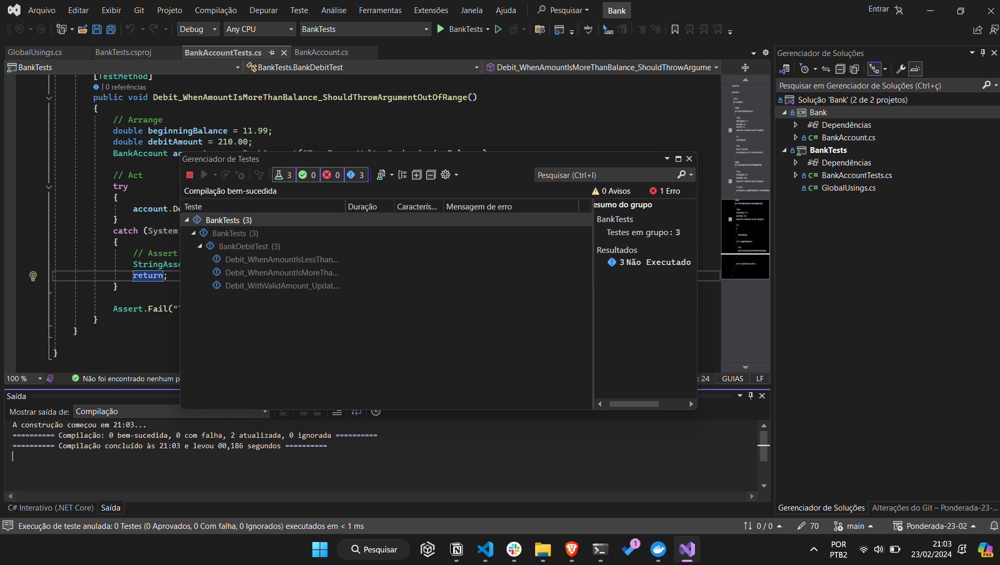

# Relatório: Testes de unitário em C# com Visual Studio

Neste relatório, exploramos os conceitos e práticas relacionadas à implementação de testes de unitário em C# usando o Visual Studio. O tutorial abrange a criação de um projeto de teste de unitário e a realização de testes para uma classe BankAccount simples.

## Tecnologia e Conceitos
### Visual Studio
O Visual Studio é um ambiente integrado de desenvolvimento (IDE) amplamente utilizado para o desenvolvimento de software. Ele fornece ferramentas abrangentes para escrever, depurar e testar código em várias linguagens de programação, incluindo C#.

### Testes de unitário
Os testes de unitário são uma prática de desenvolvimento de software em que unitários individuais de código são testadas de forma isolada para garantir que funcionem conforme o esperado. Eles ajudam a identificar bugs e problemas de integração mais cedo no ciclo de desenvolvimento, promovendo código mais robusto e de alta qualidade.

### Passo a Passo do Artigo
- Criação do Projeto Principal (Bank): Um projeto de aplicativo de console em C# foi criado para representar uma conta bancária simples. A classe BankAccount foi implementada com métodos para crédito e débito.

- Criação do Projeto de Teste (BankTests): Um projeto de teste de unitário foi adicionado à solução para testar a classe BankAccount.

- Implementação dos Testes: Foram escritos métodos de teste para verificar o comportamento da classe BankAccount, incluindo testes para valores válidos e inválidos de débito.

- Refatoração do Código e dos Testes: O código de produção e os testes foram melhorados para fornecer mensagens de erro mais detalhadas e capturar exceções de forma mais precisa.

## Resumo
Este tutorial demonstrou a importância dos testes de unitário no processo de desenvolvimento de software. Além de verificar a funcionalidade do código, os testes de unitário ajudam a promover um design mais modular e uma melhor estruturação do código.

Ao utilizar o Visual Studio e as ferramentas de teste integradas, os desenvolvedores podem criar testes de unitário eficazes que aumentam a confiabilidade e a robustez de seus aplicativos.

### Print de Código em Execução
# Ponderada-semana-3-ES9
